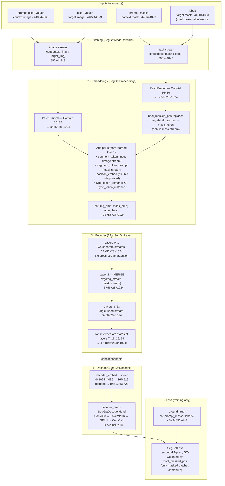
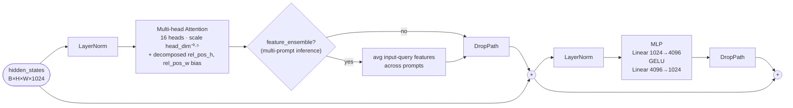

# SegGPT Model Architecture

## Overview

SegGPT is a **dual-stream masked image modeling** architecture built on ViT-L. The core idea: it runs an image stream and a mask stream through the same transformer in parallel, merges them early, then reconstructs the masked portion of the mask stream using a lightweight decoder. At inference, the "masked portion" is the target mask to predict.

---

## Data flow — what happens inside `forward()`

Before the encoder even sees anything, two stitching operations happen in `SegGptModel.forward()`:

```python
# Stack context image ON TOP OF target image (along height, dim=2)
pixel_values = torch.cat((prompt_pixel_values, pixel_values), dim=2)
# → (B, 3, 896, 448)

# Stack context mask ON TOP OF label (or mask_token at inference)
prompt_pixel_values = torch.cat((prompt_masks, labels), dim=2)
# → (B, 3, 896, 448)
```

So from this point on, there is **no separate concept of "context" and "target"** — both are concatenated into a single 896×448 image per stream.

---

## Architecture diagram



---

## SegGptLayer internals (×24)

Each layer is a standard pre-norm ViT block with **decomposed relative position bias** (from MViTv2) instead of absolute position bias in attention.



---

## Key design decisions

| Decision | Where | Why |
| -------- | ------ | --- |
| **Two stitched streams** (image + mask), not a single stream | `SegGptModel.forward()` | Lets the model learn to copy mask patterns from the context half to the target half |
| **Early merge at layer 2** instead of processing both streams all the way | `SegGptEncoder` | Saves ~50% compute for the first 3 layers; image and mask features are semantically aligned early anyway |
| **Five learnable tokens** per patch: `mask_token`, `segment_token_input`, `segment_token_prompt`, `type_token_semantic`, `type_token_instance` | `SegGptEmbeddings` | `mask_token` = what the model has to reconstruct; the segment/type tokens differentiate streams without changing the attention architecture |
| **`bool_masked_pos` only replaces patches in the mask stream**, not the image stream | `SegGptEmbeddings.forward()` | The model always sees the full target image — it only has to predict the mask, not the image content |
| **Intermediate hidden states tapped at 4 layers** (7, 11, 15, 19), concatenated → decoder | `SegGptEncoder` + `SegGptDecoder` | Multi-scale features capture both coarse semantics (deep) and fine spatial detail (shallow) |
| **Decoder is tiny** (Linear + Conv3×3 + Conv1×1) | `SegGptDecoder` | The heavy lifting is done by the encoder; the decoder just un-patchifies |
| **Loss only on masked patches** | `SegGptLoss` | Same principle as MAE — model gets no gradient for the visible context patches |
| **Decomposed relative position bias** (separate H and W 1D embeddings) | `SegGptAttention` | Works at arbitrary resolutions; absolute position embeddings are bicubic-interpolated for non-pretrain sizes |

---

## Tensor shapes at a glance (ViT-L, 448×448 input)

| Stage | Shape |
| ----- | ----- |
| Raw input (target or context image) | `(B, 3, 448, 448)` |
| After stitching (image or mask stream) | `(B, 3, 896, 448)` |
| After patch embedding | `(B, 56, 28, 1024)` |
| After batch-cat of two streams | `(2B, 56, 28, 1024)` |
| After merge at layer 2 | `(B, 56, 28, 1024)` |
| Intermediate states (×4, concatenated) | `(B, 56, 28, 4096)` |
| Decoder embed output | `(B, 512, 56, 28)` |
| Decoder pred output (pred_masks) | `(B, 3, 896, 448)` |
| Target half of pred_masks | `(B, 3, 448, 448)` |

---

## Training vs. inference difference

| Parameter | Training | Inference |
| --------- | -------- | --------- |
| `labels` | ground-truth target mask | `None` — context mask is repeated |
| `bool_masked_pos` | block-wise 75% masking of target patches | full target-half masking (all 784 patches) |
| Loss | computed on masked patches | not computed |
| Target half of `pred_masks` | reconstruction of masked GT | **the predicted segmentation mask** |
